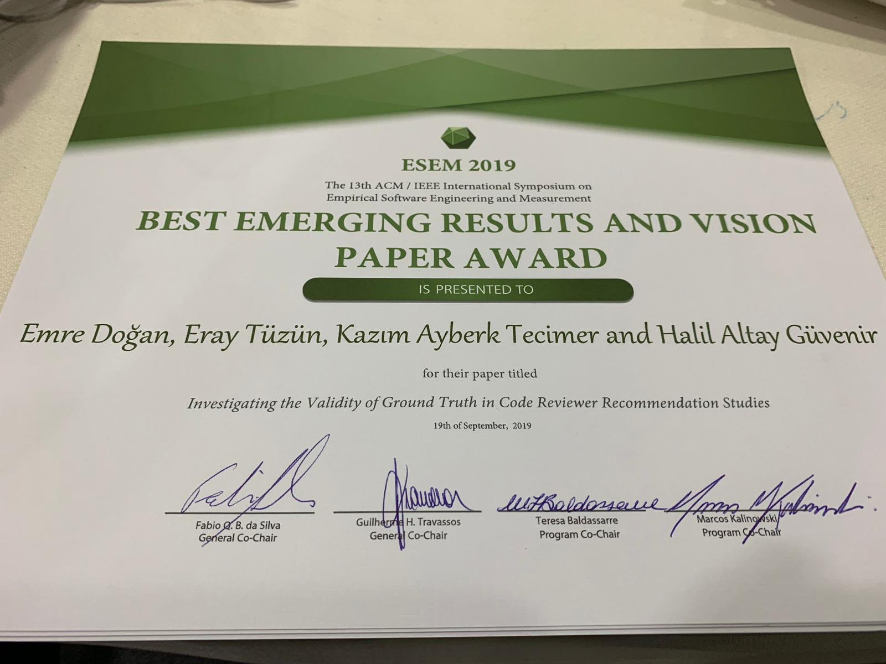

- 
Our paper “Investigating the Validity of Ground Truth in Code Reviewer Recommendation Studies” got the Best Emerging Results and Vision Paper Award in the 13th ACM/IEEE International Symposium on Empirical Software Engineering and Measurement (ESEM 2019). 

- 
Our submission titled "Adopting Integrated Application Lifecycle Management within a Large-Scale Software Company: An Action Research Approach" is accepted to ESEM 2019 Journal First Track.
 
- 
Our submission titled "Investigating the Validity of Ground Truth in Code Reviewer Recommendation Studies" (Emre Doğan,Eray Tüzün, K. Ayberk Tecimer, H. Altay Güvenir) is accepted to 2019 ACM/IEEE International Symposium on Empirical Software Engineering and Measurement (ESEM).
 
- 
Our submission titled "Reviewer Recommendation using Software Artifact Traceability Graphs" (Emre Sülün, Eray Tüzün, Uğur Doğrusöz) is accepted to 15th International Conference on Predictive Models and Data Analytics in Software Engineering - PROMISE '19 
 
- 
Two of our ACM Student Research competition papers got accepted to <a
        href="https://esec-fse19.ut.ee/">ESEC/FSE 2019 Conference </a> :
    <ul>
        <li>Hamdi Alperen Çetin: <i>Identifying the Most Valuable Developers Using Artifact Traceability Graphs</i></li>
        <li>Emre Sülün: <i>Suggesting Reviewers of Software Artifacts Using Traceability Graphs</i></li>
    </ul> 

 

- 
Our manuscript titled “An Auction-Based Serious Game for Bug Tracking" (Çağdaş
    Üsfekes, Eray Tüzün, Murat Yılmaz, Yagup Macit, Paul Clarke) is accepted to IET Software, 2019 
 
- 
Our submission titled “Towards Unified Software Project Monitoring for Organizations
    using Hybrid Processes and Tools” (Eray Tüzün, Çağdaş Üsfekes, Yagup Macit, Görkem Giray) is accepted to ICSSP
    (International Conference on Software and Systems Process) 2019 which will be held at Montreal, Canada. (May 25-26,
    2019) 
 
- 
Our submission titled “Catching up with Method and Process Practice: An
    Industry-Informed Baseline for Researchers” (HELENA consortium) is accepted to ICSE (International Conference on
    Software Engineering) 2019 Practice track which will be held at Montreal, Canada. (May 29-31, 2019) 
 
- 
Do you love coding competitions? We are organizing a Hub in B Building, so people
    from Bilkent University can enjoy this Google event.#HashCode2019 #GoogleHashCode. So far, we have 120 contestants
    signed up for the event. The event will take place at B Building, 3rd floor on Feb 28, 2019 20:30. For more
    information about Google hashcode, please checkout <a href="https://codingcompetitions.withgoogle.com/hashcode/">the link. </a>
    
 
- 
Our manuscript titled “Adopting Integrated Application Lifecycle Management within a
    Large-Scale Software Company: An Action Research Approach" (Eray Tuzun, Bedir Tekinerdogan, Yagup Macit, Kursat
    Ince) is accepted to Journal of Systems and Software, 2019 (In Press) 
 
- 
Our manuscript titled “Our manuscript titled "Closing the gap between software
    engineering education and industrial needs" (Vahid Garousi, Görkem Giray, Eray Tüzün, Cagatay Catal, Michael
    Felderer) will be published on IEEE Software, 2019.(In Press) 
 
- 
Our submission titled “Are Computer Science and Engineering Graduates Ready for the
    Software Industry? Experiences from an Industrial Student Training Program" ( Eray Tuzun, Hakan Erdogmus and Izzet
    Gokhan Ozbilgin) is accepted to International Conference in Software Engineering SEET 2018 which will be held at
    Gothenburg, Sweden. (May 31 - Jun 1, 2018) 

